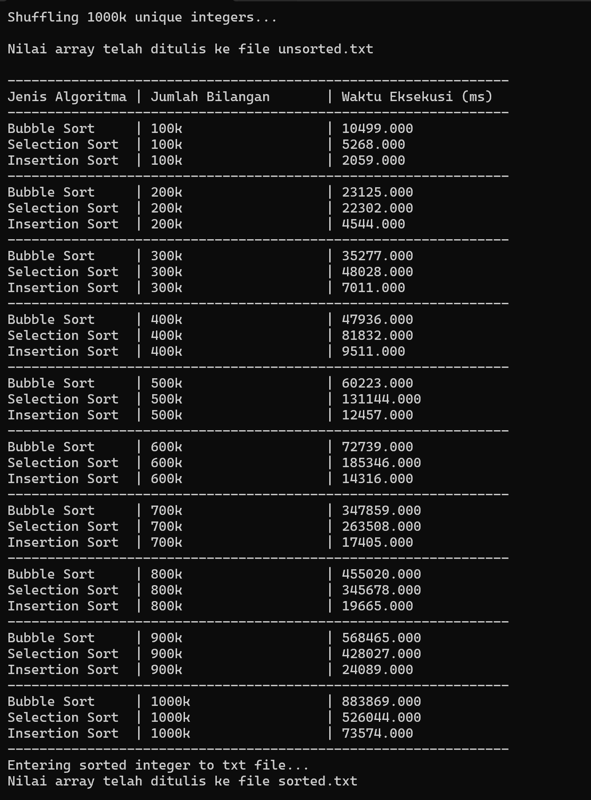

This project has been built to calculate the length of execution time for 3 types of sorting viz
- Bubble Sort
- Selection Sort
- Insertion Sort

The number of integers to be sorted is one million integers.

Sorting will be done in stages starting from 100k, 200k, and so on up to 1000k integer numbers.

The program will randomize 1000k integer numbers first and then carry out the third sorting process. I'm using Fisher-Yates Algorithm to random the numbers that are unique/numbers that will not be the same for every number

1000k unsorted integer numbers will be put into the "unsorted.txt" file and after all sorting is complete, the sorting results will be put into the "sorted.txt" file

To run this program, you only need to clone this GitHub project into your Text Editor/IDE, 
then compile main.c and run it. 

syntax for compile        : "gcc main.c -o main"
syntax for run program    : "./main"

OUTPUT EXAMPLE

